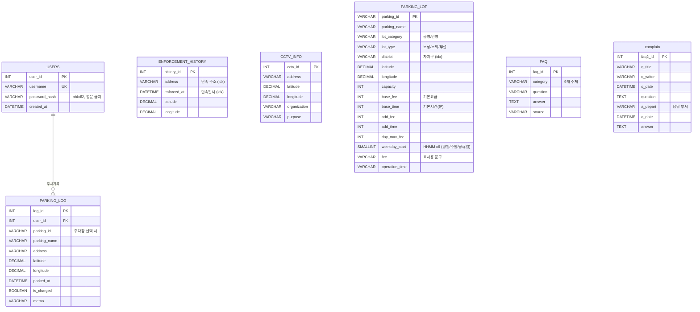

# 앗찻차! — 여기 세워도 될까?

> "앗, 여기 세우면 안 되는 곳이었네" 하고 알아채는 순간을 3초 앞당겨주는 주정차 안내 서비스

종로구의 **주차장 232곳 · 불법주정차 단속 이력 232,853건 · 단속 CCTV 196대**를
한 지도에 겹쳐 보여주고, 지금 내가 선 자리가 단속 위험 구역인지 판정합니다.
위험하면 겁만 주는 게 아니라 — **"과태료 4만원 대신 도보 3분 주차장 8천원, 3만 2천원 아껴요"** 처럼
합법 주차장을 대안으로 함께 보여줍니다.

- **배포**: <https://atchacha.streamlit.app>
- **스택**: Streamlit · Kakao Maps JS SDK · TiDB Cloud (MySQL 호환) · pandas
- **문서**: [기능명세서](docs/기능명세서.md) · [아키텍처](docs/아키텍처.md) · [계획안](docs/계획안.md) · [트러블슈팅](docs/트러블슈팅.md)

## 주요 기능

| 기능 | 설명 |
|---|---|
| 단속 위험 판정 | 내 위치(GPS·지도 마커 드래그·좌표 입력) 반경 100m의 누적 단속 건수와 최근접 CCTV 거리로 위험/주의/기록 없음 3등급 판정. 반원 게이지로 표시 |
| 절약 배너 | 예상 과태료와 근처 최저가 주차장 요금을 비교해 "얼마 아껴요"를 항상 표시 |
| 통합 지도 | 공영·민영 주차장 마커, 단속 다발구역 히트 블롭(원형, 뜨거울수록 크고 진함), CCTV, 내 주차 기록을 레이어로 켜고 끄기 |
| 주차장 추천 | 거리·여유·요금 가중 점수로 정렬한 카드 6장 + 전체 표. 예상요금은 기본/추가요금·일 최대요금 반영 |
| 시간대 분석 | 반경 내 단속이 몰리는 시간대를 막대그래프로 (종로는 20시가 피크) |
| 회원·주차 기록 | pbkdf2 해시 로그인, 주차한 자리 기록·지도 표시, 누적 절약 리포트 |
| FAQ · 민원 사례 | 주정차 FAQ 90건(주제 9종), 종로구 실제 민원·답변 91건 |

## 팀 (SKN35 1st 4Team)

| 이름 | 역할 | 담당 데이터 | 주요 파일 |
|---|---|---|---|
| **박종원** | **팀장** · 발표 준비 | 단속 CCTV 위치 (OA-20471) → `CCTV_INFO` 196대 | `collectors/cctv_api.py`, `loaders/load_to_db.py`, `loaders/tidb.py` |
| **나치훈** | 데이터 수집·관리 | 불법주정차 다발구역 (OA-22190) → `ENFORCEMENT_HISTORY` 232,853건 | `collectors/enforcement_history_api.py`, `loaders/load_to_db.py`, `loaders/tidb.py` |
| **정은미** | 데이터 수집·관리 · 화면 구현 | 종로구 상담민원 → `complain` 91건 | `collectors/faq_crawler_b.py` (Selenium), `app_pages/board.py`, `loaders/load_to_complain.py` |
| **김연주** | 데이터 수집·관리 · 화면 구현 | 주정차 FAQ → `FAQ` 90건 · 주정차 고시공고 | `collectors/faq_crawler_a.py` (고시공고), `app_pages/faq.py`, `loaders/load_to_db.py`, `loaders/tidb.py`  |
| **이승희** | 데이터 수집·관리 · 화면 구현 · 협업 관리 | 주차장 정보 → `PARKING_LOT` 232곳 | `collectors/seoul_parking.py`, `main.py`, `app_pages/home.py`, `app_pages/login.py`, `app_pages/mypage.py`, `loaders/load_to_db.py`, `loaders/tidb.py`, `common/*`, `loaders/*` |

> 초기에 있던 단속 다발구역·CCTV 개별 페이지는 홈 지도의 레이어로 통합되었습니다.
> 수집·정제한 데이터는 그대로 홈 화면의 핵심 재료로 쓰입니다.

## 폴더 구조

```
.
├── main.py                  # 진입점(라우터) — st.navigation 으로 페이지·메뉴 구성
├── config.py                # 설정 로더 (.env → st.secrets 순서로 탐색)
│
├── app_pages/               # 화면
│   ├── home.py              #   홈: 통합 지도 + 위험 판정 + 추천
│   ├── faq.py               #   자주 묻는 질문
│   ├── board.py             #   민원 사례
│   ├── login.py             #   로그인·회원가입
│   └── mypage.py            #   내 주차 기록
│
├── common/                  # 공유 모듈
│   ├── ui.py                #   앗찻차 디자인 시스템 (팔레트·히어로·게이지·일러스트·카드)
│   ├── kakao_map.py         #   카카오맵 HTML 빌더 (마커·히트 블롭·드래그·범례)
│   ├── risk_data.py         #   단속·CCTV 로더 + 위험 판정 + 시간대 분석 + 히트 블롭 집계
│   ├── parking_data.py      #   주차장 로더 (DB → CSV 폴백)
│   ├── recommend.py         #   예상요금·운영여부·추천 점수 (순수 함수 + 자체 테스트)
│   ├── geolocation.py       #   브라우저 GPS + 지도 드래그 좌표 브리지 (CCv2)
│   ├── auth.py              #   회원가입·로그인 (pbkdf2, MySQL/SQLite 자동 전환)
│   ├── parking_log.py       #   주차 기록 CRUD
│   ├── db.py                #   SQLAlchemy 엔진 (TiDB SSL 자동 설정)
│   └── geo.py               #   거리 계산
│
├── collectors/              # 데이터 수집 (담당자별)
├── loaders/                 # CSV → DB 적재
│   ├── load_all.py          #   주차장·CCTV·FAQ·민원·단속이력 일괄 적재
│   ├── load_to_db.py        #   테이블별 정규화 + 적재 공통 로직
│   └── check_db.py          #   접속·테이블 상태 진단
│
├── db/schema.sql            # 전체 테이블 정의
├── assets/                  # 앗찻차 로고·아이콘 SVG
├── data/cleaned/            # 정제 CSV (대용량 단속 이력은 git 제외 → DB로만 배포)
└── docs/                    # 기능명세서·아키텍처·계획안·트러블슈팅
```

## 빠르게 실행하기

```bash
git clone <repo-url> && cd SKN35-1st-4Team
uv sync
cp .env.example .env    # 값 채우기 (아래 표)
uv run streamlit run main.py
```

| 키 | 용도 | 없으면 |
|---|---|---|
| `DB_HOST` `DB_PORT` `DB_USERNAME` `DB_PASSWORD` `DB_DATABASE` | TiDB Cloud(또는 로컬 MySQL) | 주차장만 CSV로 동작, 단속·CCTV·로그인 제한 |
| `KAKAO_JS_KEY` | 카카오맵 (JavaScript 키) | 지도 미표시 |
| `KAKAO_REST_KEY` | 주소→좌표 변환 | 좌표 직접 입력만 가능 |
| `SEOUL_OPENAPI_KEY` | 실시간 주차 여유 (OA-21709) | 여유 정보 없이 동작 |

카카오 키는 [developers.kakao.com](https://developers.kakao.com) → 플랫폼 → Web 에
`http://localhost:8501` 이 등록돼 있어야 합니다 (**포트가 다르면 차단**).

## 데이터 적재

```bash
uv run python loaders/load_all.py          # 5개 테이블 일괄 (비우고 새로)
uv run python loaders/load_all.py --only PARKING_LOT FAQ
uv run python loaders/check_db.py          # 접속·행 수 진단
```

단속 이력 CSV(24MB)는 git에 없으므로 배포판은 **DB에서만** 읽습니다.
새 clone에서 전체 재적재가 필요하면 팀원에게 CSV를 받아 `data/cleaned/`에 두세요.

## 배포 (Streamlit Community Cloud)

1. share.streamlit.io → Create app → 이 레포 / `main` / `main.py` / Python 3.12
2. **Settings → Secrets** 에 위 표의 키들을 TOML로 입력 (따옴표 필수)
3. 카카오 콘솔 Web 도메인에 `https://<앱이름>.streamlit.app` 추가
4. 코드 푸시 후 반영이 안 보이면 **Reboot app**

앱 화면의 「설정 진단」이 어떤 키가 전달됐는지(값은 숨김) 알려줍니다.
상세한 실패 사례는 [트러블슈팅](docs/트러블슈팅.md) 참고.

## ERD



## 데이터 소스

| 소스 | 형태 | 비고 |
|---|---|---|
| **서울 주차정보안내시스템** (parking.seoul.go.kr) | 내부 AJAX 크롤링 | 주력. 공영+민영, 좌표 100%, 종로구 232곳 |
| 서울시 불법주정차 단속 정보 (OA-22190) | CSV | 232,853건 (2024-03 ~ 2025-12) |
| 서울시 단속 CCTV 위치 (OA-20471) | Open API | 196대 |
| 서울시 실시간 주차정보 (OA-21709) | Open API | 시영 주차장 현재 주차대수 → 여유 점수 |
| 서울시설공단 FAQ · 종로구 민원 | 크롤링 | FAQ 90건 · 민원 91건 |
| 서울시 공영주차장 안내 (OA-13122) | CSV | **미사용** — 좌표 117/850뿐, 크롤링으로 대체 |
