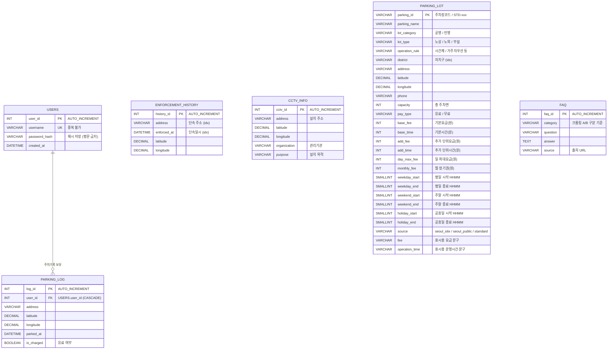

# 주정차 제한 정보 조회 및 주변 주차장 안내 시스템

공공데이터 + 웹 크롤링 + Streamlit + 카카오맵 + MySQL(DBeaver) 기반 팀 프로젝트.
지금은 팀원별로 각자 페이지에서 작업하고, 완성 후 통합할 예정입니다
(FAQ 두 페이지는 최종적으로 한 페이지로 합칠 계획).

## 담당 매핑

| 담당 | 데이터 | 파일 |
|---|---|---|
| 치훈 | 서울시 불법주정차 단속 정보 (OA-22190) | `collectors/enforcement_history.py`, `pages/1_단속_다발구역.py` |
| 종원 | 단속 CCTV 위치정보 (OA-20471) | `collectors/cctv_api.py`, `pages/2_CCTV_지도.py` |
| 승희 | 데이터 통합 첫 화면(주차장+단속 다발구역+CCTV), 단속 위험 판정, 로그인·주차기록 | `main.py`, `collectors/seoul_parking.py`, `common/parking_data.py`, `common/recommend.py`, `common/risk_data.py`, `common/geolocation.py`, `common/auth.py`, `common/parking_log.py`, `pages/6_로그인_회원가입.py`, `pages/7_마이페이지.py` |
| 연주 또는 은미 | 크롤링 A (FAQ - 이용안내 계열) | `collectors/faq_crawler_a.py`, `pages/4_FAQ_이용안내.py` |
| 연주 또는 은미 | 크롤링 B (FAQ - 단속·견인·이의신청 계열) | `collectors/faq_crawler_b.py`, `pages/5_FAQ_단속견인.py` |

## 폴더 구조

```
.
├── main.py                    # 승희 - 첫 화면: 통합 지도 + 내 위치 단속 위험 판정
├── config.py                  # .env 로더 (MySQL 접속정보, 카카오/공공데이터 키)
├── pyproject.toml / uv.lock   # uv 의존성
├── .env.example               # 환경변수 템플릿 (실제 .env는 git 제외)
│
├── pages/                     # Streamlit 멀티페이지 (사이드바에 자동 표시)
│   ├── 1_단속_다발구역.py      # 치훈
│   ├── 2_CCTV_지도.py          # 종원
│   ├── 4_FAQ_이용안내.py       # 연주 또는 은미  ┐ 추후 한 페이지로
│   ├── 5_FAQ_단속견인.py       # 연주 또는 은미  ┘ 통합 예정
│   ├── 6_로그인_회원가입.py     # 승희
│   └── 7_마이페이지.py         # 승희 - 주차 등록 + 주차 기록
│
├── common/                    # 공유 유틸
│   ├── db.py                  # MySQL 연결 + read_sql/execute
│   ├── kakao_map.py           # 카카오맵 HTML 빌더 (커스텀 마커/말풍선/범례/지오코딩)
│   ├── geo.py                 # 거리 계산 (지오코딩 함수 포함 - REST 키 발급 시 사용)
│   ├── auth.py                # 승희 - 회원가입·로그인 (pbkdf2 해싱, MySQL/SQLite 자동 전환)
│   ├── risk_data.py           # 승희 - 단속 다발구역·CCTV 로더 + 위험도 판정
│   ├── geolocation.py         # 승희 - 브라우저 현재 위치 (st.components.v2)
│   ├── parking_log.py         # 승희 - 주차 기록 저장·조회·요약
│   ├── recommend.py           # 승희 - 예상요금·운영여부·추천 점수 (순수 함수, 자체 테스트 포함)
│   ├── parking_data.py        # 승희 - 주차장 데이터 로더 (DB -> CSV -> 즉석 수집 폴백)
│   └── ui.py                  # 공통 디자인 (CSS, 히어로 배너, 카드, 상태 칩)
│
├── collectors/                # 데이터 수집 스크립트 (담당자별)
│   ├── enforcement_history.py     # 치훈 - 단속이력 CSV 정제 + 다발구역 집계
│   ├── cctv_api.py                # 종원 - 서울 열린데이터광장 Open API
│   ├── seoul_parking.py           # 승희 - 주차정보안내시스템 크롤링 + 실시간 여유(OA-21709)
│   ├── faq_crawler_a.py           # 연주 또는 은미 - 서울시설공단 FAQ (정적, 확인됨)
│   └── faq_crawler_b.py           # 연주 또는 은미 - 견인/민원링크/고시공고
│
├── db/
│   └── schema.sql             # 전체 테이블 CREATE문 (DBeaver에서 실행)
│
├── loaders/
│   └── load_to_db.py          # 정제 CSV → MySQL 적재 공통 스크립트
│
└── data/
    ├── raw/                   # 수집 원본
    └── cleaned/               # 정제 결과 (loaders가 여기서 읽음)
```
## ERD


## 처음 시작할 때 (팀원 각자 1회)

```bash
git clone <repo-url>
cd <repo>
uv sync                        # pyproject.toml/uv.lock 기준으로 가상환경 자동 생성
cp .env.example .env           # .env 열어서 값 채우기
```

`.env`에 채울 값 (현재 사용하는 키는 2개 + MySQL 접속정보):

- `MYSQL_*` — DBeaver에서 만든 로컬 MySQL 접속 정보
- `KAKAO_JS_KEY` — 카카오 개발자 콘솔 > 앱 키 > **JavaScript 키** (지도 표시용)
- `DATA_GO_KR_API_KEY` — 공공데이터포털(data.go.kr) 인증키

`SEOUL_OPENAPI_KEY`(서울 열린데이터광장)는 종원 담당 CCTV Open API를 쓸 때
필요해지면 그때 `.env`에 추가하면 됩니다 (없어도 앱은 동작).

## DB 만들기 (1회, DBeaver에서)

```sql
CREATE DATABASE parking_project DEFAULT CHARACTER SET utf8mb4;
```

이후 `parking_project`를 선택한 상태에서 `db/schema.sql` 전체를 실행합니다.

## 실행

```bash
uv run streamlit run main.py
```

DB나 카카오 키가 아직 없어도 모든 페이지는 샘플 데이터로 동작합니다.

## 데이터 수집 -> 정제 -> 적재 흐름

1. `collectors/`의 본인 담당 스크립트 실행 → `data/raw/` 또는 `data/cleaned/`에 저장
2. `uv run python loaders/load_to_db.py --csv data/cleaned/xxx.csv --table 테이블명` 으로 MySQL 적재
3. Streamlit 페이지에서 확인 (`@st.cache_data` 캐시 때문에 바로 안 보이면 10분 대기 또는 앱 재시작)

### 주차장 검색 (승희) 파이프라인

현재 검색 범위는 **종로구**입니다 (`common/parking_data.py`의 `DISTRICTS`).
저장소에 `data/cleaned/parking_lot.csv`가 들어있어 별도 준비 없이 바로 동작합니다.

수집 범위를 바꾸려면 CSV를 다시 만들면 됩니다.

```bash
uv run python collectors/seoul_parking.py                    # 종로구 232곳, 좌표 100%
uv run python collectors/seoul_parking.py --district all      # 서울 25개구
```

DB에 넣으려면 위 CSV를 그대로 적재합니다.

```bash
uv run python loaders/load_to_db.py --csv data/cleaned/parking_lot.csv --table PARKING_LOT --if-exists truncate
```

추천 로직은 스트림릿 없이 단독 검증됩니다.

```bash
uv run python common/recommend.py   # 예상요금·운영여부·추천 점수 테스트
```

### 로그인 · 주차기록 (승희)

`.env`에 MySQL 정보가 있으면 MySQL의 `USERS` / `PARKING_LOG` 을 쓰고,
없으면 `data/app.db`(SQLite)를 자동으로 만들어 씁니다. `.env`만 채우면 코드 수정 없이 넘어갑니다.

- 비밀번호는 `pbkdf2_sha256`(반복 20만회 + 사용자별 salt)으로 해시해서 저장하고 평문은 남기지 않습니다.
- 로그인 상태는 `st.session_state`에 두므로 **브라우저를 새로 고치면 로그아웃**됩니다
  (쿠키를 쓰려면 별도 컴포넌트가 필요해서 의도적으로 세션 기반으로 뒀습니다).
- `data/app.db`는 개인 데이터라 `.gitignore`에 넣었습니다.

## 데이터 소스 메모 (실제로 열어서 확인한 결과)

| 소스 | 형태 | 비고 |
|---|---|---|
| 서울시 불법주정차 단속 정보 (OA-22190) | CSV 다운로드 (분기별 12개) | 단속일시/단속주소/위도/경도 |
| 서울시 단속 CCTV 위치정보 (OA-20471) | Open API (서울 열린데이터광장 키 필요) | 파일 다운로드 미제공 |
| **서울특별시 주차정보안내시스템** (parking.seoul.go.kr) | 내부 AJAX(`SearchParkingBy.do`) 크롤링 | **주력 소스.** 자치구 단위로 공영·민영·부설을 모두 주고 **좌표 100%**. 종로구 232곳 (공영 52 / 민영 180). 페이징 없음 |
| 서울시 공영주차장 안내 정보 (OA-13122) | CSV 다운로드 (`seoul_parking.csv`, EUC-KR) | **미사용.** 850곳 중 좌표가 117곳뿐이고 민영이 없어서, 위 크롤링 데이터로 완전히 대체됨 (요금·정기권까지 크롤링 쪽이 더 채워짐) |
| 서울시 실시간 주차정보 (OA-21709) | Open API (`SEOUL_OPENAPI_KEY`) | 시영주차장 122곳의 현재 주차대수 → 추천의 '여유 점수'에 사용 |
| 서울시설공단 공영주차장 FAQ (sisul.or.kr) | 정적 게시판 | requests+bs4로 크롤링 확인됨 |
| 종로구시설관리공단 견인 안내 (ijongno.co.kr/www/422) | 정적 페이지 | requests+bs4로 크롤링 확인됨 |
| 서울시 고시공고 '주정차' 키워드 | JS 렌더링 | Selenium 필요 (faq_crawler_b.py TODO) |
| 새올민원창구/응답소/국민신문고 | 로그인 필요 | 크롤링 대신 안내 링크로 수록 |

