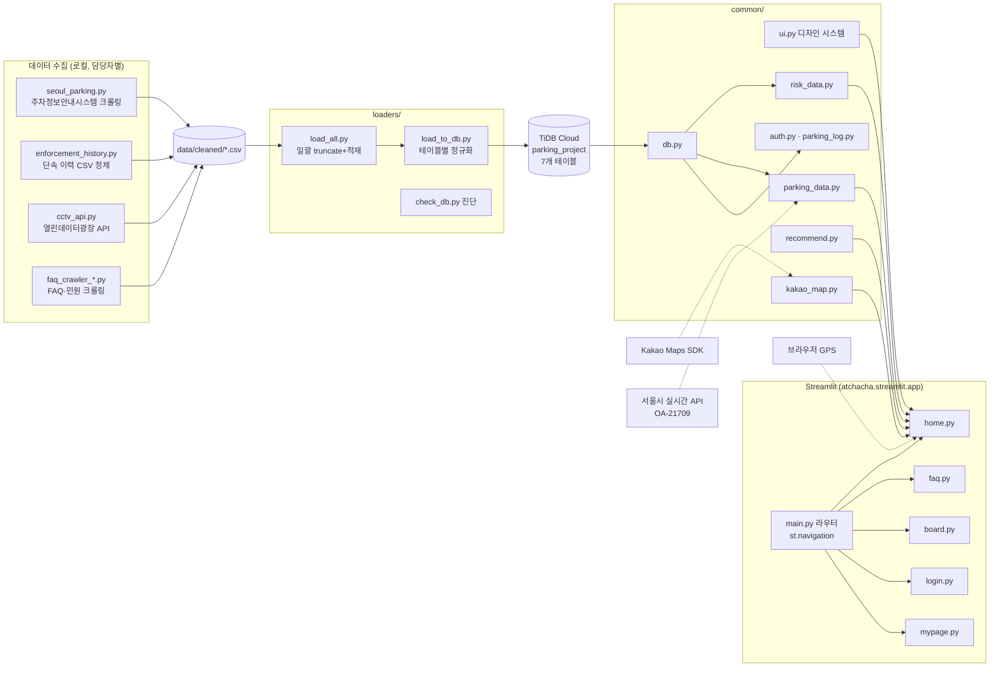

# 앗찻차! 아키텍처

## 전체 구성



## 계층별 설명

### 1. 진입점 — `main.py` (라우터)

`st.navigation`으로 메뉴를 구성한다. 파일명이 아니라 정한 이름(홈·자주 묻는 질문…)이
사이드바에 뜨고, **로그인 상태에 따라 「로그인」↔「내 주차 기록」 메뉴가 교체**된다.
`set_page_config`·전역 CSS·브랜드 로고는 여기서 1회만 적용한다.

### 2. 화면 — `app_pages/`

각 파일은 순수한 화면 코드다. 데이터 접근·계산은 전부 `common/`에 위임하고,
페이지는 "무엇을 어디에 그릴지"만 결정한다.

### 3. 공유 모듈 — `common/`

| 모듈 | 책임 | 핵심 설계 |
|---|---|---|
| `db.py` | SQLAlchemy 엔진 1개(lru_cache) | TiDB 호스트면 certifi CA로 SSL 자동 구성. `DataSourceError` 정의 |
| `parking_data.py` | 주차장 로더 | **DB → CSV → 즉석 수집** 3단 폴백. 단, DB 설정이 있는데 실패하면 폴백하지 않고 예외 (아래 '폴백 정책') |
| `risk_data.py` | 단속·CCTV 로더, 위험 판정, 시간대 집계, 히트 블롭 | 23만 행을 그대로 받지 않고 SQL에서 `ROUND(좌표,5)+GROUP BY`로 17만→집계 후 전송. 캐시 키에 파일 mtime 포함 |
| `recommend.py` | 예상요금·운영여부·추천 점수 | 순수 함수 + 파일 하단 자체 테스트 240줄. `pd.NA` 진리값 함정 방어 |
| `kakao_map.py` | 지도 HTML 문자열 생성 | 마커·히트 블롭·드래그·범례·SDK 실패 안내까지 한 파일. srcdoc iframe 렌더 |
| `geolocation.py` | GPS·드래그 좌표 브리지 | CCv2 컴포넌트 2종. 지도 iframe → `postMessage` → 브리지 → 파이썬 |
| `ui.py` | 디자인 시스템 | 팔레트 상수, 히어로, 게이지, 일러스트 5종, 주차장 카드, 절약 배너. **모든 SVG는 data URI ``** (아래 'SVG 정책') |
| `auth.py` / `parking_log.py` | 계정·주차 기록 | pbkdf2, MySQL↔SQLite 자동 전환 |

### 4. 데이터 계층

```
TiDB Cloud (Serverless, ap-northeast-1)
├── PARKING_LOT          232행   ← collectors/seoul_parking.py
├── ENFORCEMENT_HISTORY  232,853행 ← 치훈 정제 CSV (24MB, git 제외)
├── CCTV_INFO            196행   ← 종원 API
├── FAQ                  90행    ← 연주·은미
├── complain             91행    ← 연주·은미 (민원)
├── USERS / PARKING_LOG  사용자 생성 (loaders가 건드리지 않음)
```

- 연결: PyMySQL + `ssl: {ca: certifi.where()}` (TiDB Serverless는 SSL 필수, `ssl_mode` 키는 PyMySQL이 모름)
- 풀: `pool_pre_ping` + `pool_recycle=280` (클라우드가 유휴 연결을 끊는 것 대비)
- 적재: 5,000행 청크 `method="multi"` (23만 행 패킷 한도 대응)

## 핵심 설계 결정

### 폴백 정책 — "조용한 CSV 폴백은 버그를 숨긴다"

초기엔 DB 실패 시 조용히 CSV로 넘어갔다. 그 결과 **SQL 문법 오류(`%%` escape)가
몇 주간 가려진 채** 화면은 멀쩡해 보였다. 지금 규칙:

| 상황 | 동작 |
|---|---|
| DB 설정 없음 (`.env` 없는 새 clone) | CSV 폴백 — 팀원 로컬 개발용 |
| DB 설정 있음 + 조회 실패 | **화면에 원인 표시 후 정지** (`DataSourceError`) |
| DB 설정 있음 + 테이블 빈 것 | 빈 결과 그대로 — 적재 안내 표시 |

### SVG 정책 — DOMPurify 대응

`st.html`은 DOMPurify로 새니타이즈하며 **인라인 `<svg>`를 통째로 제거**한다.
그래서 모든 그림은 `svg_img()`로 base64 data URI ``로 넣는다.
이 방식에선 바깥 CSS가 SVG 내부에 닿지 않으므로 **애니메이션은 SVG 문서 안의
`<style>`에** 넣고, `fill-mode: both`처럼 시작 상태(투명)에 갇힐 수 있는
속성은 쓰지 않는다. CSS 주석에조차 꺾쇠 태그 문자열을 쓰면 스타일 블록이
통째로 삭제되므로 금지.

### 캐시 전략

| 대상 | ttl | 무효화 |
|---|---|---|
| 주차장·단속·CCTV 목록 | 30분 | 캐시 키에 CSV mtime 포함 → 수집기 재실행 시 즉시 반영 |
| 실시간 주차 여유 | 60초 | — |
| FAQ·민원 | 10분 | — |

### 배포 구성

```
GitHub (main) ──push──▶ Streamlit Community Cloud
                              │  requirements.txt (런타임 전용 슬림 목록)
                              │  Secrets: DB_* , KAKAO_* (TOML)
                              ▼
                    atchacha.streamlit.app ──SSL──▶ TiDB Cloud
                              │
                              └─▶ Kakao SDK (도메인 등록 필수, 포트 단위)
```

- `config.py`가 **환경변수 → `st.secrets`** 순으로 찾으므로 코드 수정 없이 양쪽 대응
- 카카오 SDK는 srcdoc iframe에서 `location.protocol`을 읽지 못해 내부 번들을
  http로 요청 → https 배포에서 Mixed Content 차단. `document.write` 가로채기로
  https 강제 (트러블슈팅 #11)
- 수집 전용 패키지(selenium 등)는 requirements에서 제외 — 클라우드에 브라우저가 없음
